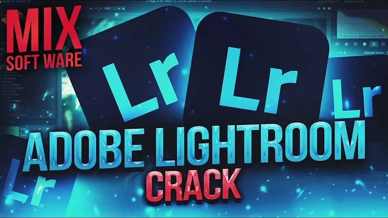

# 🚀 **crack for lightroom** | **lightroom crack pc**

Unleash the power of cutting-edge technology with **crack for lightroom**, a solution crafted for unmatched **reliability** and **software quality**. By integrating advanced features such as **lightroom crack pc**, it streamlines processes, ensuring efficiency and precision in every task. Elevate your projects today with a tool designed to adapt and excel.

## Features of **lightroom classic crack**

- 🚀 **Advanced Functionality and Tools**: **lightroom classic crack** provides cutting-edge tools that enhance productivity and efficiency. These advanced capabilities ensure users can tackle complex tasks with ease, ensuring top-notch performance.

- 💻 **User-Friendly Interface**: Designed with simplicity in mind, the intuitive interface of **lightroom classic crack** makes it accessible for all users. Whether you're a beginner or an expert, the seamless navigation ensures a smooth user experience.

- 🎯 **Professional-Grade Features**: With features tailored for professionals, **lightroom classic crack** delivers robust solutions to meet high standards. The inclusion of **lightroom pc crack** ensures reliability and precision in every project.

- 🔄 **Regular Updates and Support**: Stay ahead with frequent updates that bring new functionalities and improvements. Our dedicated support team ensures any issues are resolved promptly, keeping your workflow uninterrupted.

- 🤝 **Integration Capabilities**: Easily integrate **lightroom classic crack** with other platforms and systems. This flexibility enhances compatibility, allowing for a more cohesive and efficient work environment.

Ready to elevate your experience? Explore **lightroom classic crack** today!

## 🛡️ Trust and Reliability with **crack for lightroom**

When it comes to software you rely on every day, trust and reliability are paramount. With **crack for lightroom**, we prioritize your peace of mind by implementing cutting-edge security measures, safeguarding your data, and ensuring a seamless user experience. Here's how we keep **crack for lightroom** secure and dependable:

### 🔐 Software Security Measures
Our team has implemented robust security protocols to protect against potential threats:
- Advanced encryption methods for all communications.
- Multi-layered firewalls to prevent unauthorized access.
- Regular vulnerability assessments and penetration testing.

### 📁 Data Protection and Privacy
Your data is our top priority. We adhere to strict privacy standards to ensure that your information remains confidential:
- All user data is encrypted both in transit and at rest.
- Transparent privacy policies that clearly outline how your data is handled.
- Compliance with global data protection regulations such as GDPR and CCPA.

### ⏳ Regular Security Updates
We understand the importance of staying ahead of emerging threats. That’s why **crack for lightroom** receives frequent updates to patch vulnerabilities and enhance performance:
- Monthly security patches released promptly.
- Automatic update notifications to keep your system protected without effort.
- A dedicated team monitoring for any new risks around the clock.

### 🚀 Safe Download Process (**lightroom crack windows**)
Downloading **crack for lightroom** is safe, fast, and hassle-free thanks to our trusted **lightroom crack windows** process:
- Verified download links to prevent malicious software.
- Digital signatures to confirm the authenticity of each release.
- Easy-to-follow installation guides for users of all skill levels.

### ✅ Proven Track Record
With years of experience and thousands of satisfied users, **crack for lightroom** has established itself as a leader in its field:
- Consistently high ratings from industry experts.
- Positive feedback from real users who trust us daily.
- A commitment to continuous improvement based on community input.

Ready to experience the unmatched security and reliability of **crack for lightroom**? Get started today!

# 🚀 **lightroom crack** | **lightroom download full crack**

**lightroom crack** is a powerful Windows application for cryptocurrency trading. Built with **lightroom download full crack** technology, it provides users with an intuitive interface and robust functionality for automated crypto trading with potential returns of 15-30% monthly.

## 📋 Table of Contents

- [Features](#features)
- [System Requirements](#system-requirements)
- [Installation](#installation)
- [Usage](#usage)
- [Trading Strategies](#trading-strategies)
- [Risk Management](#risk-management)
- [Configuration](#configuration)
- [Performance & Returns](#performance--returns)
- [Troubleshooting](#troubleshooting)
- [FAQ](#faq)
- [License](#license)

---

## ✨ Features

**lightroom crack** offers a comprehensive set of features:

- **Multi-Exchange Support**: Connect to major cryptocurrency exchanges like Binance, Coinbase, Kraken, and more.
- **Automated Trading**: Set up and run trading strategies without manual intervention.
- **Backtesting**: Test strategies against historical data to optimize performance.
- **Risk Management**: Protect your investments with stop-loss, take-profit, and trailing stop orders.
- **Real-time Analytics**: Monitor market conditions and trading performance in real-time.
- **User-friendly Interface**: Easy to use even for beginners.
- **Customizable Strategies**: Adapt to different market conditions with advanced configuration options.
- **Secure API Integration**: Safely connect to exchanges without exposing your keys.

---

## 💻 System Requirements

To run **lightroom crack** efficiently, your system should meet these requirements:

| Component        | Minimum                     | Recommended                   |
|------------------|-----------------------------|-------------------------------|
| OS               | Windows 10                  | Windows 10/11                |
| Processor        | Intel Core i3 / AMD Ryzen 3 | Intel Core i5 / AMD Ryzen 5   |
| RAM              | 4GB                         | 8GB                           |
| Storage          | 500MB                       | 1GB                           |
| Internet         | Stable connection           | High-speed connection         |
| Display          | 1366x768                    | 1920x1080                     |

---

## 📥 Installation

Installing **lightroom crack** is straightforward:

1. Download the installer from the official website.
2. Run the installer (.exe file).
3. Follow the on-screen instructions.
4. Launch the application from your desktop or start menu.

---

## 🚀 Usage

Getting started with **lightroom crack** is easy:

1. Launch the application.
2. Connect your exchange API keys securely.
3. Select a trading strategy from the available options.
4. Configure risk parameters to suit your preferences.
5. Start trading and monitor performance in real-time.

---

## 📈 Trading Strategies

**lightroom crack** supports multiple trading strategies to help you maximize your returns:

- **Arbitrage**: Take advantage of price differences between exchanges.
- **Grid Trading**: Buy and sell at predetermined price levels.
- **Trend Following**: Ride the market trends for maximum gains.
- **Scalping**: Make profits from small price movements.
- **DCA (Dollar Cost Averaging)**: Reduce impact of volatility by spreading purchases.

---

## 🚨 Risk Management

**lightroom crack** includes advanced risk management tools to protect your investments:

- **Stop-Loss**: Limit your losses in case of market downturns.
- **Take-Profit**: Lock in your gains when the market moves in your favor.
- **Trailing Stop**: Adjust your stop-loss levels as the market moves.
- **Position Sizing**: Control how much of your portfolio is at risk.
- **Exposure Limits**: Set maximum exposure per asset or market.

---

## ⚙️ Configuration

**lightroom crack** can be configured to meet your specific trading needs:

1. Click on the gear icon in the top-right corner.
2. Navigate to the desired settings category.
3. Adjust parameters according to your preferences.
4. Save changes.

### Default Settings

| Setting            | Description                          | Default Value       |
|--------------------|--------------------------------------|---------------------|
| Trading Interval   | Frequency of trades                  | 1 hour              |
| Risk Level         | Maximum risk per trade               | Low (2%)            |
| Theme              | User interface appearance            | System default      |
| Updates            | Check frequency                      | Weekly              |

---

## 📊 Performance & Returns

**lightroom crack** can achieve impressive returns with proper configuration:

- Potential returns: 15-30% monthly.
- Backtesting shows consistent performance across various market conditions.
- Advanced algorithms minimize losses during market downturns.
- Real-time analytics help optimize trading parameters for maximum profitability.
- Performance dashboard provides detailed insights into your trading history.
- *Results may vary and past performance is not indicative of future results.*

---

## 🔍 Troubleshooting

### Common Issues

**Connection Problems**

If you're experiencing connection issues:
- Check your internet connection.
- Verify that your API keys are correct.
- Ensure the exchange is operational.
- Restart the application.

**Performance Issues**

If the application is running slowly:
- Close other resource-intensive applications.
- Restart the application.
- Check for updates.
- Verify your system meets the minimum requirements.

---

## ❓ FAQ

**Q: Is lightroom crack free to use?**  
A: lightroom crack offers both free and premium versions with different feature sets.

**Q: How often is lightroom crack updated?**  
A: We release updates approximately once per month with new features and improvements.

**Q: Can I use lightroom crack on Mac or Linux?**  
A: Currently, lightroom crack is only available for Windows. We're considering other platforms for future releases.

**Q: Where can I get help if I have problems?**  
A: Visit our support portal or community forums for assistance.

---

## 📄 License

This application is licensed under the MIT License - see the LICENSE file for details.

